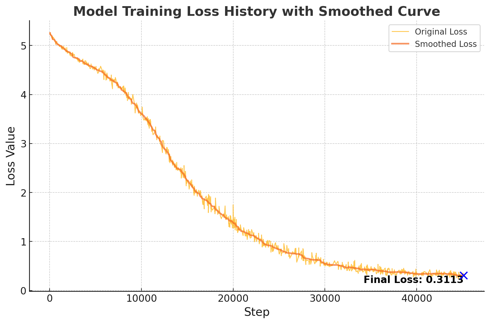

# ViT-Assembler
This repository presents a self-supervised learning approach utilizing a Vision Transformer (ViT) Encoder to solve a jigsaw puzzle as a pretext task. By shuffling image patches and training a transformer to reconstruct the original order, the model is able to learn high-quality representations suitable for various downstream tasks. Unlike previous methods that use token masking or hybrid architectures, our method employs a pure transformer encoder trained specifically to solve the jigsaw puzzle problem.

### Method
The methodology involves dividing images into patches, permuting those patches, and using a transformer encoder to predict their original positions. The following describes the core components of our method:

1. **Image Patching**: Each input image is divided into a grid of non-overlapping patches. These patches are treated as input tokens for the Vision Transformer, which essentially converts the input image into a sequence of tokens, where each token contains local visual information from a distinct part of the image.

2. **Patch Permutation**: For each image, the sequence of patches is randomly shuffled to create a jigsaw puzzle configuration. A unique permutation is generated for each image, and this permutation is then applied to reorder the patches. The goal is to provide a challenging pretext task that requires the network to infer both local and global spatial relationships.

3. **Jigsaw Prediction Task**: The shuffled patches are fed into the Vision Transformer encoder, which then attempts to predict the original position of each patch. Specifically, the model outputs a sequence, where each token corresponds to a particular patch, and each token output has a classification head that predicts the original position of that patch. For an image that is split into a 14x14 grid, each output token corresponds to one of 196 possible positions.

4. **Training Objective**: The objective function is the cross-entropy loss between the predicted positions and the true original positions of the patches. By minimizing this loss, the model learns the spatial dependencies between image patches, which results in robust and transferable feature representations.

### Why Does This Work?
The task of solving a jigsaw puzzle forces the model to understand both local patch content and their spatial relationships across the entire image. This is similar in spirit to denoising or masked token prediction, where the model must reconstruct occluded parts of the input by leveraging context. By learning how to rearrange shuffled patches, the model captures meaningful high-level semantic information, which is transferable to a wide range of downstream visual tasks. 

### Related Work
Our work is inspired by prior efforts in self-supervised learning that involve solving jigsaw puzzles or utilizing Vision Transformers for representation learning:
- Noroozi, M., & Favaro, P. (2016). *Unsupervised Learning of Visual Representations by Solving Jigsaw Puzzles*. URL: https://arxiv.org/pdf/1603.09246
- Misra, I., & Maaten, L. (2019). *Self-Supervised Learning of Pretext-Invariant Representations*. URL: https://arxiv.org/pdf/1912.01991
- Rasheed, K. et al. (2024). *Solving Masked Jigsaw Puzzles with Diffusion Vision Transformers*. URL: https://arxiv.org/pdf/2404.07292
- Sarwat, M. et al. (2022). *JIGSAW-VIT: LEARNING JIGSAW PUZZLES IN VISION TRANSFORMER*. URL: https://arxiv.org/pdf/2207.11971

## Training Details
- **Dataset**: The model was pre-trained for 50 epochs on the COCO dataset without any supervision or labels.
- **Architecture**: We utilized a Vision Transformer (ViT) Encoder with the following hyperparameters:
  - `image_size = 224`
  - `patch_size = 16`
  - `dim = 384`
  - `depth = 10`
  - `heads = 12`
  - `mlp_dim = 1536`
  - `channels = 3`
  - `dim_head = 32`
  - `device = "cuda"`

  The base ViT implementation is based on the work by Lucidrains: https://github.com/lucidrains/vit-pytorch/blob/main/vit_pytorch/simple_vit.py

### Training Loss
Below is the training loss plot for the jigsaw puzzle task over 50 epochs:

The steady decrease in training loss demonstrates that the model is effectively learning to reconstruct the original order of shuffled patches.

## Evaluation on Downstream Task
After pre-training, we evaluated the effectiveness of the learned representations by transferring them to a classification task on the Caltech-256 dataset (URL: https://www.kaggle.com/datasets/jessicali9530/caltech256). The transformer encoder was frozen, and a single classification head was trained on top of the learned features.

### Downstream Classification Results
- **Dataset**: Caltech-256
- **Setup**: Encoder frozen, training a single linear classification head.
- **Loss and Accuracy Plots**: Below are the plots for training loss and accuracy during evaluation:

The results indicate that the representations learned through the jigsaw pretext task are highly effective for downstream classification, as evidenced by strong accuracy and consistent reduction in classification loss.

## Conclusion
This repository presents a rigorous approach for self-supervised learning using Vision Transformers. The proposed jigsaw puzzle task provides an effective mechanism for learning spatially-aware and generalizable features without any labeled data. The learned representations have demonstrated strong potential for transfer learning in downstream tasks, indicating their robustness and versatility.

### Key Points
- **No Masking, Pure Jigsaw Task**: In contrast to recent approaches, our method does not employ masking but instead focuses directly on solving a permutation problem with a transformer encoder.
- **Task-Agnostic Features**: The model learns representations that are not task-specific, making them suitable for a variety of downstream applications.
- **Transferable Learning**: The quality of the learned features is evaluated via transfer learning on the Caltech-256 classification task.

## Usage
- Clone the repository and install the necessary dependencies.
- Use the provided training scripts to pre-train the transformer encoder on COCO.
- Fine-tune on a downstream classification task using the provided evaluation scripts.

Feel free to adapt and modify the code to apply to your own datasets and experimental setups.

## Future Work
- **Improving Pre-training Efficiency**: Exploring larger datasets, improved architectures, or better optimization techniques to enhance the quality of learned representations.
- **Extending to Different Modalities**: Applying the same jigsaw puzzle approach to other data types, such as video, audio, or multimodal data.

### Contributions
Contributions are welcome. Please open an issue or submit a pull request if you have any suggestions for improvements or new features to add.

